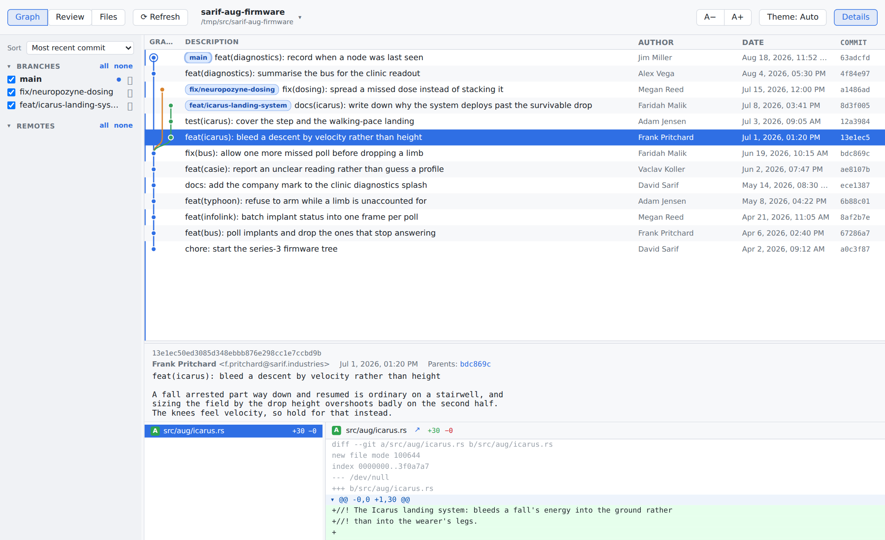
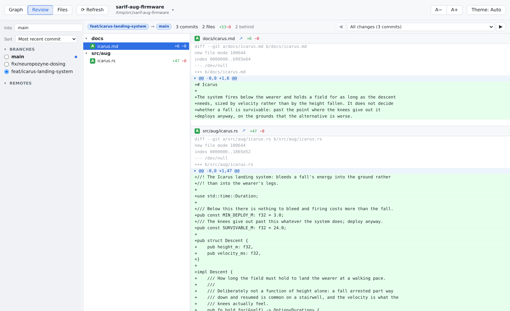
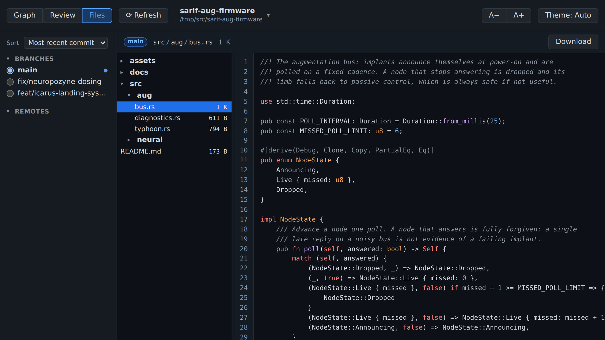

# Commit Browser

A SourceTree-style commit graph browser for git repositories.



Three views, switched from the toolbar:

- **Graph** - the commit graph across any set of branches, with a details pane
  showing the selected commit's diff
- **Review** - one branch against the branch it would merge into, pull-request
  style: the whole branch diff as a file tree, and a picker to step through the
  branch's individual commits. Fold a hunk with the arrow on its `@@` header, or
  drag down the lines to fold just that group; folds are remembered per
  comparison
- **Files** - the repository as it stands at one revision, with
  syntax-highlighted sources and images shown as pictures. The revision is a
  branch picked in the sidebar, or the commit a diff was read from: each file
  name in a diff links through to itself here. In the web variant each file also
  has a download link; the desktop build has no equivalent and leaves the button
  out

Images appear in place, both in a diff and in the files view. Anything over
100 KB waits behind a button instead: the bytes travel base64 encoded, since the
desktop build has no URL to point at, and that is a slow thing to spend on a
picture nobody asked to see.

Several repositories can be to hand, one browsed at a time. The selector at the
top left lists them by name over path, since a name alone does not tell two
checkouts apart; picking one is a move like any other, so back and forward walk
between repositories as well as within them.





The history in the screenshots is invented, and so is everyone in it. The
repository they are taken against is built by
[`docs/screenshots/make-demo-repo.sh`](docs/screenshots/make-demo-repo.sh).

It comes in two variants that share the frontend (`src/`) and all repository
reading (`gitcore/`):

- a desktop app (`src-tauri/`), which keeps the reader's own list of
  repositories, added through a file dialog
- a web server (`src-server/`), which serves the same UI over HTTP for the
  repositories named on its command line

The two differ only in `src/backend-{tauri,web}.ts`, selected by Vite's `--mode`.

## Downloads

Every release carries prebuilt artifacts for Linux, macOS and Windows, two per
platform: `commit-browser-app-*` for the desktop app and
`commit-browser-server-*` for the web server.

Each is the thing itself rather than an archive around it. The exception is the
macOS app, which is a `.app` bundle and therefore a directory, so it travels as
a zip. Downloads do not keep their permissions, so on Linux and macOS the file
needs `chmod +x` before it will run.

The web server is a single file with the frontend compiled into it, so there is
nothing to install beside it; the Linux build is statically linked and runs on
any distribution. The desktop app borrows the webview the operating system
already has - WebView2 on Windows, WKWebView on macOS - and ships as an AppImage
on Linux, which carries the GTK and webkit libraries it needs.

The macOS builds are universal, running on Apple silicon and Intel alike.
Nothing is code-signed, so macOS and Windows will both ask before running a
download.

## Desktop app

```
npm install
npm run tauri dev      # or: npm run tauri build
```

Add repositories from the bottom of the repository selector. The list is the
reader's own and is remembered between runs; removing one takes it out of the
list and leaves it alone on disk.

## Web server

Build the frontend and run the server against a repository:

```
npm install
npm run build:web
cargo build --release -p commit-browser-server
./target/release/commit-browser-server --repo /path/to/repo
```

Repeat `--repo` to serve several at once, or hand it a directory they sit in:

```
./target/release/commit-browser-server --repo ~/src/one --repo ~/src/two
./target/release/commit-browser-server --repo-dir ~/src
```

`--repo-dir` takes every repository directly inside that directory and no
deeper, so a workspace can be served without naming its contents. Worktrees are
understood: several checkouts of one repository appear once, as the checkout it
was made in. Both flags repeat and can be mixed; a repository reached more than
one way is still one entry.

The list is fixed by that command line: the page offers no way to add to it,
which is what keeps the server to the repositories it was pointed at.

Then open <http://127.0.0.1:4600>.

`build:web` has to run first: the frontend is compiled into the binary, so the
result is a single file that can be copied to another machine on its own.

The URL follows where you are, so back and forward work and a position can be
shared or bookmarked. Each carries `repo=<path>`, the repository as the server
lists it, and then what within it: `/graph?repo=<path>&commit=<sha>`,
`/review?repo=<path>&head=<branch>&base=<branch>` (with `&commit=<sha>` for one
commit of the branch), and `/files?repo=<path>&rev=<branch-or-sha>&path=<file>`.
A URL with no `repo=` opens the first repository the server was given.

The server binds loopback, so from a workstation reach a remote dev machine
through an SSH tunnel:

```
ssh -L 4600:127.0.0.1:4600 devbox
```

There is no authentication and no way to reach a repository the server was not
given; `--host 0.0.0.0` gives anyone who can reach the port read access to
every repository served, including their full history and diffs.

Options: `--repo` and `--repo-dir` (both repeatable), `--host`, `--port`, and
`--static-dir` to serve the frontend from a directory instead of the copy
compiled into the binary.

### Developing the web variant

Run the server for the API and Vite for the frontend; Vite proxies `/api` to the
server on port 4600:

```
npm run server -- --repo /path/to/repo
npm run dev:web        # http://localhost:1421
```

## Icons

`public/favicon.svg` is the source. The web variants serve it as their favicon,
with `public/favicon.ico` behind it for browsers that want one, and the desktop
icon set is generated from it:

```
npx tauri icon public/favicon.svg
```

That writes icons for every platform Tauri knows about; `src-tauri/icons/` keeps
the desktop ones, which is all this project builds for. The `.ico` is not
optional on Windows: the build fails without it.
